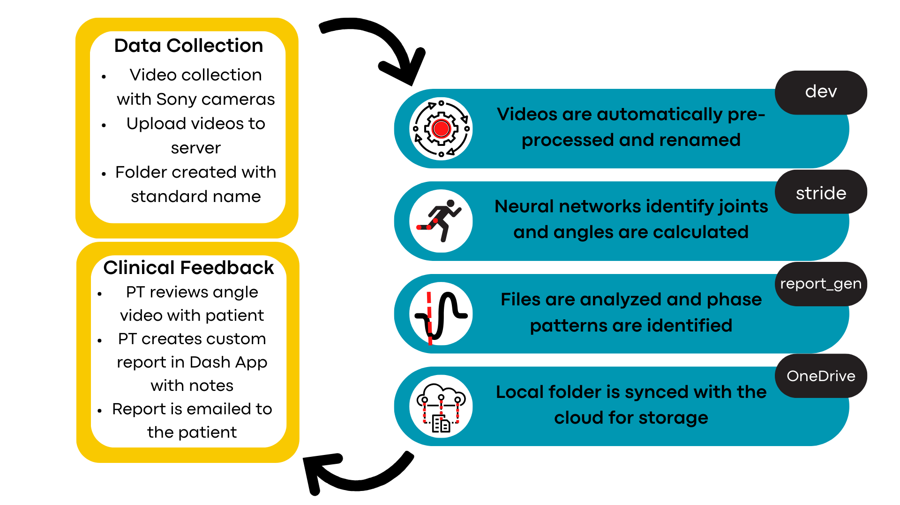
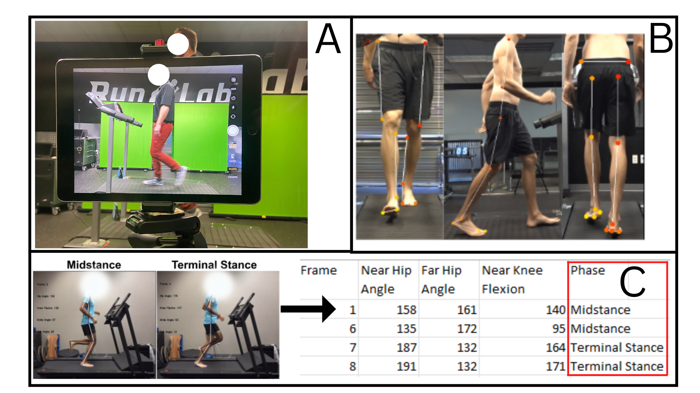
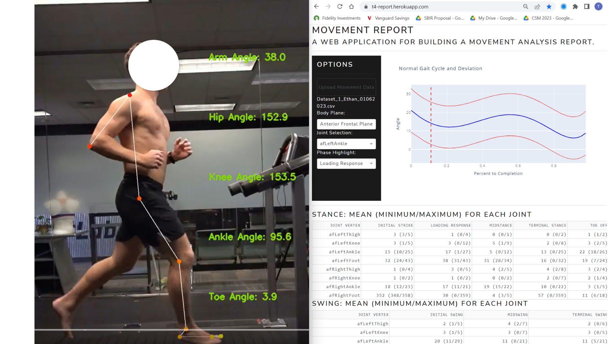
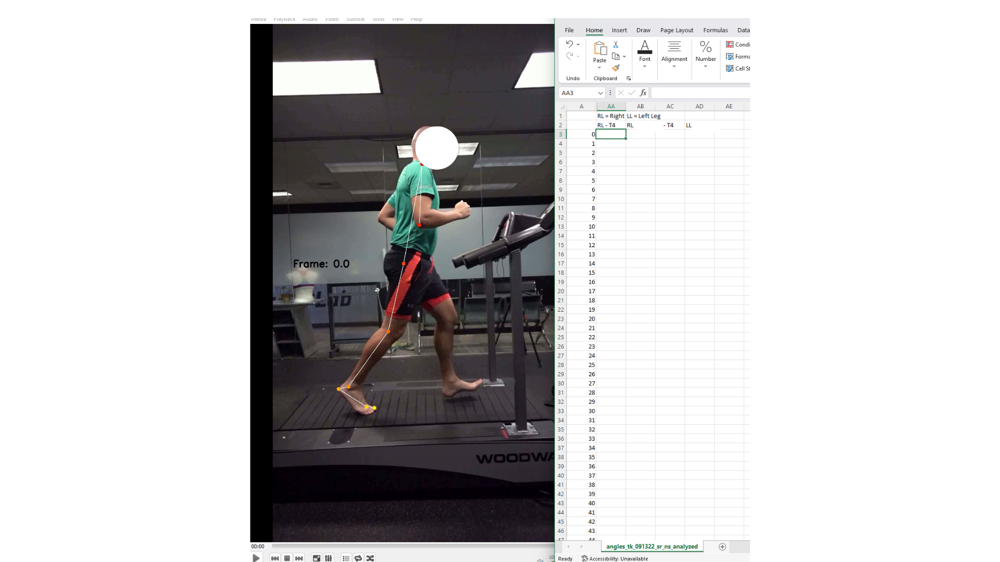
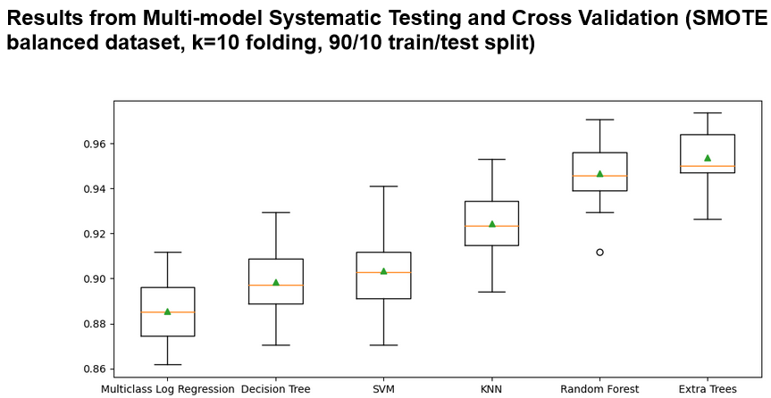
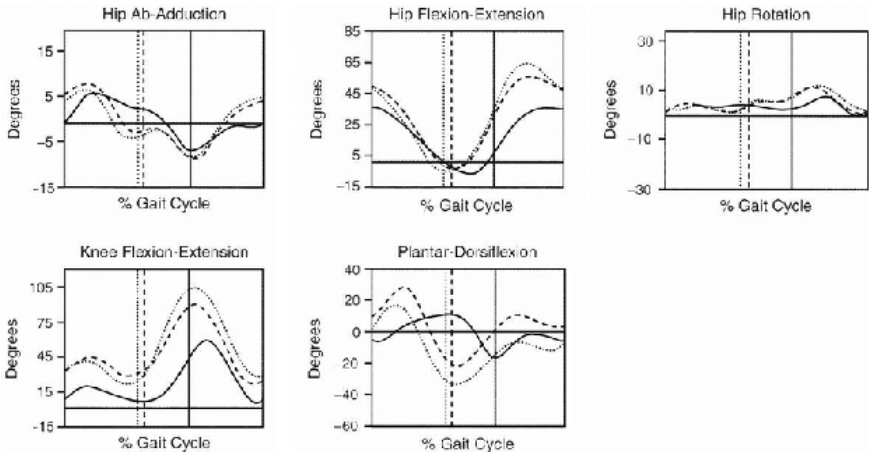
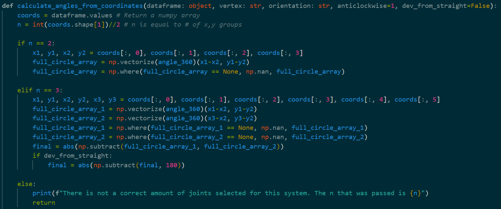
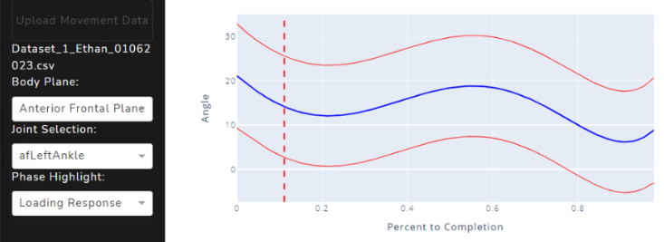

# 1. Project Overview
The T4 project was a state-of-the-art markerless pose estimation software used to evaluate gait - running and walking movement - in Physical Therapy (PT) patients. It was designed to address a set of problems encountered in physical therapy gait analysis:
    
1. Lack of quantitative assessment tools
2. Large time demand for PT's to manually review videos of patient gait patterns
3. Lack of standardization and accuracy of gait evaluations

We addressed these issues by collecting video data of patient gait in a specially designed room, creating custom datasets and labeling them, then using custom computer vision and machine learning models to measure patient movements.

# 2. Solution Architecture
## 2.1. A Note on Data Security
This project involved collecting patient data in a clinical environment. We ensured data integrity and patient safety by adhering to HIPAA Protected Health Information regulatory guidance. Therefore, data was handled entirely within the clinical environment, and utilized encrypted servers on premises and the cloud storage infrastructure (OneDrive) that was the property of the clinics that we worked with. Patients were educated on the data life cycle and thoroughly briefed on the implications before they signed waivers to allow the use of their data. 

#### Figure 1: Data Flow Overview

#### Figure 2: Photos of Process

## 2.2. Data Collection
Video data was collected from four angles (Figure 2, Section A and B) at specific speeds in 10-second blocks. Sony cameras were chosen for their ability to:

1. Be mounted in fixed positions around the patient (front, sides, and rear)
2. Record in sync, maintaining the same frame number across all cameras
3. Capture high frame rates for more detailed data.

This setup included a custom room with a modified treadmill (to reduce sagittal occlusion), the cameras, and a computer interface for clinicians. Before training the models used to identify joints and gait patterns, the T4 team and clinicians had to **gather more than 400 video recordings of patients. The original dataset was composed of these samples** and enabled the developments mentioned later.

A semi-automated process was devised to enable quick and easy data collection during dataset development and after going live. The videos of a patient's gait were recorded and uploaded into a patient's folder. A Powershell script on the local encrypted server would watch for these events (dev/bin/WatchToFlip.ps1). The videos would be pre-processed by flipping the videos to the correct orientation, renaming them, and increasing contrast of the video.

## 2.3. Data Processing
These videos were then put into a processing directory where the product/stride/main.py script would be run. This script would **use our pose estimation models to infer the position of joints**, seen in Figure 2 Section B. This pixel data was stored in .h5 files. Basic trigonometry was used to calculate the angles between dots along specified axes (product/stride/angle_finder.py). After this process was completed, **a .csv file containing all of the calculated angles was created, as well as a video with the joints and angles written on it.** 

Finally, at the end of video and .csv creation, a machine learning model would be run on the .csv. It would take a row of angles, and predict the phase of gait that the individual was in during that row, see Figure 2 Section C. This was an entirely **novel development, to our knowledge, and a specific request from the PT's**. Having the phase of gait labeled on the .csv and frame simplified the review process. 

#### Figure 3: Data Review and Reporting

## 2.4. Data Processing and Sharing
PTs could review the .csv file by uploading it to our deployed Dash app, which enabled individualized patient data analysis. They could **highlight the phase of gait, isolate the perspective of the movement plane (ex. Anterior Frontal), and look at the movement patterns**. These reports also allowed the PT to input patient information and prescriptive exercise plans for the patient and email it to them from their own email addresses. 

## 2.5. Data Storage
All raw and generated data was archived in patient folders on the local encrypted server and the HIPAA-compliant cloud service used by the clinics. This process was automated through cloud tools and Powershell scripts that continuously monitored relevant directories.

# 3. Technical Development
## 3.1. Joint Identification with Neural Networks
The Physical Therapists that conduct gait analysis go through extensive training to review patient movement patterns (usually directly watching them, but also with videos) and identify altered movement patterns. This process relies heavily on the relative relationship of the patient's joints. To mirror this, our first step was to pinpoint the exact joint locations PTs focus on, down to specific bone protrusions. These reference points varied across the anterior, sagittal, and posterior planes, so we developed three separate models to identify the necessary joints for each perspective, which was documented for our labeling team.

Next, we reviewed the literature and found a paper from [Alexander Mathis, et al.](https://www.nature.com/articles/s41593-018-0209-y). In this paper the team describes a process of labeling the "body parts" of animals in videos. Then, they fit a pre-trained Residual Neural Network (ResNet-50) to the data, a process called transfer learning. This process is documented in the GitHub repository [DEEPLABCUT](https://github.com/DeepLabCut/DeepLabCut). The T4 team modified the DEEPLABCUT package to customize it to the practical requirements of this project. 

We utilized the labeling and training tools provided by the DEEPLABCUT package to label a proprietary dataset that we curated. This dataset contained video data of more than 400 patients. We took care to ensure that the dataset was representative of the diversity (size, shape, skin color, etc.) of the population so that the models created from it would perform on every patient. We did this by estimating the normal distribution of our patient population for relevant variables, and sought to label patients on the outer edges of this distribution. In practice, this process proved successful.

Labeling was completed by a team of Biomedical Engineers, with guidance and reviews from the PT's. Additionally, as models were run with patient data, low performers were identified, and used to add to the dataset that we curated, creating a feedback loop that enhanced model performance over time.

**This specialized dataset and fine-tuning of a ResNet-50 model allowed our models to outperform other markerless and marker-based pose estimation software, especially in handling occlusions, irregular gait, and patients at the extremes of the normal distribution.**

## 3.2. Phase of Gait Recognition Models
Interviews with the Physical Therapists revealed that they were conducting manual frame-by-frame reviews of video data to identify specific phases of gait and review the patient's posture in these phases. Automating this process became a key feature to reduce the time spent collecting quantitative data.

Before going further, here is a brief explanation of the phases of gait:
The human gait cycle is divided into two main phases—swing (foot off the ground) and stance (foot on the ground)—which must occur for the gait cycle to be complete. 
Here are the sub-phases for the stance phase:
- Initial Strike: The first frame in which the foot is making contact with the ground following the swing phase
- Loading Response: The phase in between Initial Strike and Midstance.
- Midstance: The point of maximum triple flexion. Typically, when the midpoint of the foot is nearly in alignment with the hip “keypoint.”
- Terminal Stance: The propulsion phase in between Midstance and Terminal Stance.
- Toe Off: The last frame with the toe (and/or foot) still on the ground.

#### Figure 4: Phase of Gait Labeling Process

With these definitions, the labeling team went frame by frame and labeled a dataset for the phases of gait. The input data, in this case, was the angle information that was calculated by the joint identification models. These labels were randomly sampled and reviewed by a team of PT's to ensure that the standards were upheld. A total of 4000 labeled rows were generated by the team.

Due to the nature of phase labeling, this dataset was inherently unbalanced. Some phases represent transition states between instantaneous states. For example, the 'Initial Strike' phase was contained in one frame, while the 'Loading Phase' was usually spread between 10-15 frames. To address this, we used the data augmentation strategy Synthetic Minority Over-sampling Technique (SMOTE) to create synthetic examples of under-represented phases, and we undersampled the phases that were more represented. Despite initial concerns, models trained on SMOTE-augmented data outperformed those trained on imbalanced datasets. These dataset creation processes are documented in dev/pgr_ml/dataset_creator.py and systematic_test.py.

A systematic testing suite compared the performance of six machine learning models: Linear (Multi-Class Logistic Regression), Non-linear (Decision Tree, SVM, K-Nearest Neighbor), and Ensemble (Random Forest, Extra Trees). We used this approach to experimentally explore what algorithm would perform best on this dataset. A k-fold cross validation test was used to provide a reliable estimate of model accuracy and reduce the risk of overfitting in a single train-test split. The results can be seen below in Figure 5. 

#### Figure 5: Boxplot of Accuracy and Standard Deviation of the K-fold Cross Validation Test

Further hyperparameter tuning and increased size of the dataset created a model that was **98% accurate** when trained with the Extra Trees algorithm. This approach can be reviewed in the dev/pgr_ml/prototyper.ipynb file. 

## 3.3. Data Analysis Features
The details of how this data is generated have been covered above. The purpose of this section is to connect the output of the technical development to the original business problems encountered by the PT's.

### 3.3.1. Angles
The Physical Therapists that we spoke to often complained that they lacked objective and quantitative tools to conduct gait analysis. In practice, the Standard of Care is often just the direct observation of a patient walking or running. The PT uses their intuition and experience to form a hypothesis of what the cause of altered movement patterns is. Then, they go through several iterative cycles to address the problem. More advanced clinics have begun using other tools. Some use video based analysis, and use software to draw on the screen to make measurements of the angles of a patient's joints. But, this requires manual, frame-by-frame review. Often taking 4-7 days to complete.

To address these challenges, the T4 team sought to automate this process. Since the gold standard clinics already relied on a number of angles for diagnosis of gait deficiencies we started with these. **Specifically, they requested a graph of the average angle of a specific joint over the percent of the gait cycle.** In one case, a PT provided the following image as inspiration, see Figure 6. It is taken from an unknown source in the physical therapy literature.

#### Figure 6: Example of Desired Output

To generate a nearly identical graph we followed this process (See product/report_gen/gait_slicer.py):
1. Calculate the angles using trigonometry and the packages numpy and math in python (Figure 7)
2. Upload the .csv containing angles into the Dash Application (Mentioned in section 3.5)
3. Import the data into a pandas dataframe
4. Slice the dataframe into complete cycles by locating the "Initial Strike" phase
5. Concatenate a new column to store the "Percent to Completion" data, and calculate that value for each cycle
6. Reindex to percent complete, then graph the result
7. Create standard deviation lines 

#### Figure 7: Calculation of Angles Example

The resulting graphs were updated live as the PT's used our dashboard application. A graph for every measured joint angle (32 joint angles in total) could be created and reviewed. Figure 8 offers an example of the resulting graph. By using the plotly and dash app packages, we were able to create interactive graphs that allowed the PT's to highlight a point on the graph and see the specific X and Y values of that point. As well as zooming in and out, taking photos, and printing the output.

#### Figure 8: Final Product

### 3.3.2. Phases of Gait
One of the most time consuming aspects of reviewing gait footage is going through the videos of a patient's gait frame-by-frame and annotating the frame to measure the joint angle. In the clinics that we worked with, they had a specialized technician that completed this step. But, the T4 team noticed that these phases could be strictly defined and standardized. Therefore, we generated the hypothesis that *If the phases of gait are defined by objective standards, then we can use joint angle data and consistent labeling to automate this process.* 

Through subsequent experiments, alluded to in section 3.2. we generated a model that was able to do so with 98% accuracy. An example of this result can be seen in Figure 8, where the midpoint of the "Loading Phase" is highlighted. This is in accordance with the business requirement and example provided in Figure 6.

## 3.4. App Deployment
During the production phase of the T4 Movement project, a [Dash App](https://dash.plotly.com/) was hosted on a Heroku server. The app allowed PT's from multiple clinics to simultaneously access the dashboard, securely upload the .csv file that contained gait data (angles and phases of gait for all 4 planes; Note: No PHI was stored in these files.), and conduct an in-depth review of the data using the analytical tools mentioned earlier. 

# 4. Results and Impact
To assess the results, we'll revisit the business problems from Section 1 and discuss the impact of using the T4 software.

#### Business problems:
1. Lack of quantitative assessment tools
2. Large time demand for PT's to manually review videos of patient gait patterns
3. Lack of standardization and accuracy of gait evaluations

Before T4, clinics used a DSLR on a tripod to record patient gait, often with inconsistent placement, leading to inaccurate angle measurements. The fastest clinic we encountered had a technician label a few joint angles in select gait phases based on PT requests. This process lacked standardization, varied across patients and visits, and took 4-7 days to complete. Additionally, joint measurement points and phase definitions were inconsistently communicated between PTs and technicians.

With the physical hardware setup in the clinic, we standardized data collection. With the datasets that we created by labeling joints in videos and phases of gait we created rigorous definitions that were adhered to and went through multiple review processes. These point address the third business problem mentioned - the need to improve standardization and accuracy during the evaluation process. 

The software outlined here is purpose-built to solve the first business problem, lack of quantitative assessment tools. We ended up returning data on 32 joint angles simultaneously and synced to the frame on an average 10 strides per patient.

The entire data collection process went from 10 minutes using the old process to 2 minutes on average with the new process. The biggest difference came from data processing. The entire process for running model inferences, calculating angles, and generating aggregated data resources for the PT's to review took 1.5 minutes. So, at the fastest, the old process could be completed in approximately 5760 minutes (4 days * 24 hours * 60 minutes) and we could generate a much larger volume of data in about 3.5 minutes. So in about 0.06% of the time. This addressed business problem number 2. 

# 5. Technologies Used
## Programming Languages and Data Analytics Libraries:
- Python
        - dash
        - imblearn
        - matplotlib
        - numpy
        - pandas
        - plotly
        - sklearn
        - statsmodels
- Powershell Script
